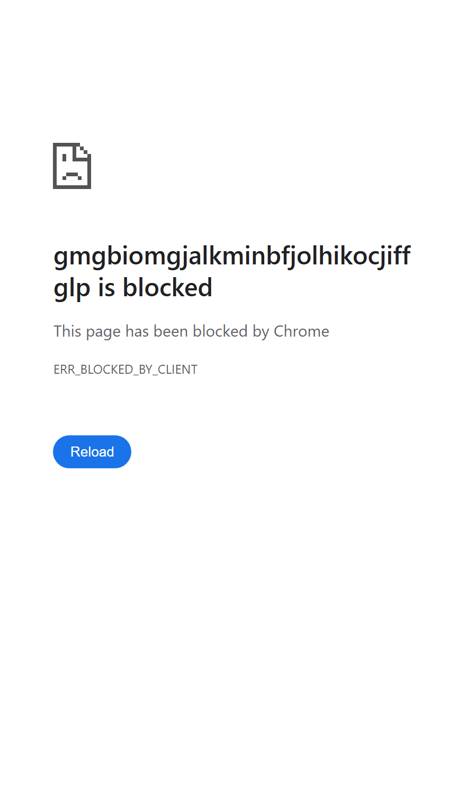
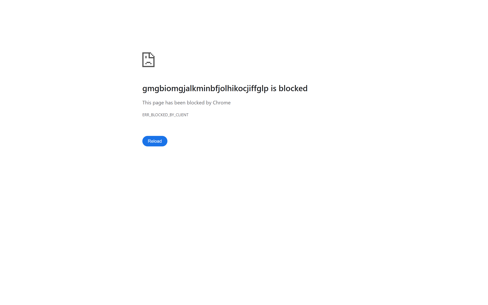

# Building WireData: Turning Ephemeral Web Traffic into Queryable SQL Datasets with DuckDB-WASM & Manifest V3

*Published on [ramwise.dev](https://ramwise.dev) · August 2026 · 12 min read*

---

## Introduction: The "Copy as cURL" Problem

Every frontend developer, data engineer, and QA analyst knows the ritual:

1. Open DevTools Network tab.
2. Filter for `Fetch/XHR`.
3. Click a request, copy the response body, and paste it into an online JSON viewer.
4. Copy another request, paste both into a scratch Python script or `jq` one-liner to join, filter, or aggregate.
5. Need TypeScript types? Copy it into `quicktype`.
6. Need to export to Excel? Write another script or risk formula injection vulnerabilities (`=CMD|'...'`) in ad-hoc CSV exports.

Modern web applications exchange gigabytes of structured, rich JSON data every second. Yet our tools for inspecting, querying, and structuring that data have remained virtually unchanged since 2012.

**WireData** is an open-source, local-first developer productivity extension and analytical workbench built to change that. It captures structured JSON network payloads and DOM tables from your active browser tab, automatically detects array collections and schema lineage, and registers them into an in-browser **DuckDB-WASM** database engine—letting you write fast analytical SQL, generate TypeScript interfaces, and export safe datasets in one click, with **zero bytes ever leaving your machine**.

---

## 📸 Key Use Cases & Visual Overview

### 1. Side Panel Companion: Zero-Friction Capture & Type Generation

WireData lives directly alongside your web application in Chrome's native Side Panel.


*Figure 1: The Side Panel companion automatically pins to the active web tab, tracks captured JSON fetch/XHR traffic, discovers array collections (`orders`, `items`), and generates TypeScript interfaces in one click.*

- **On-Demand Permission Model**: Zero host permissions on install. When you click **Start Capture**, Chrome triggers a native one-click domain permission request (`optional_host_permissions`) preserving user gesture activation.
- **Candidate Collection Detection**: Automatically inspects nested JSON responses to find repeating record collections (e.g., `/data/orders`, `/items`), tracking capture counts and aggregate row counts in real time.
- **Instant Developer Exports**: 1-click copy for TypeScript interfaces (`interface OrderItem { ... }`), JSON Schemas, NDJSON/JSONL, and spreadsheet-safe CSV.

---

### 2. Full SQL Data Workbench: Candidate Aggregation & Lineage

Clicking **Workbench ↗** opens the full-screen analytical studio.


*Figure 2: The Workbench captures view displays captured endpoints, normalized route templates, HTTP methods, status codes, timing metrics, and candidate collections.*

- **Route Normalization**: Intelligent parameter masking converts endpoints like `/api/orders/9182/items` into route templates (`/api/orders/{id}/items`) and attributes GraphQL operations from URL search params.
- **Multi-Route Combined Datasets**: Aggregate 10+ paginated API requests into a single unified dataset with configurable deduplication policies (`keep_latest`, `keep_all`, `keep_first`).

---

### 3. In-Browser Analytical SQL with DuckDB-WASM

The centerpiece of WireData is an embedded analytical SQL engine running completely client-side in a WebAssembly worker.


*Figure 3: Querying combined live application data with DuckDB analytical SQL in milliseconds directly in Chrome.*

```sql
-- Analyze order distributions directly from live captured JSON traffic
SELECT 
    status,
    count(*) AS total_orders,
    round(avg(total_amount), 2) AS avg_order_value,
    round(sum(total_amount), 2) AS gross_revenue
FROM orders
GROUP BY status
ORDER BY gross_revenue DESC;
```

- **Blazing Fast Analytics**: Powered by DuckDB's vectorized columnar engine compiled to WebAssembly (`duckdb-mvp.wasm`).
- **Schema Evolution**: Automatically registers inferred columns, handles nested objects via JSON stringification or dot-delimited flattening, and maps logical types (`VARCHAR`, `BIGINT`, `DOUBLE`, `BOOLEAN`, `TIMESTAMP`).

---

### 4. Datasets Explorer & Lineage Tracking


*Figure 4: Datasets Explorer showing schema definitions, active row records, provenance lineage metadata, and formula-safe export tools.*

---

## 🛠️ Architecture & Deep-Dive Engineering Challenges

Building a high-performance analytical engine inside Chrome Manifest V3 presented several unique systems challenges:

```
┌────────────────────────────────────────────────────────────────────────┐
│                        Chrome Active Web Page                          │
│  ┌─────────────────────────┐            ┌───────────────────────────┐  │
│  │ Injected MAIN Hook      │            │ DOM Table / Grid Scraper  │  │
│  │ (fetch / XHR override)  │            │ (virtualized row crawler) │  │
│  └───────────┬─────────────┘            └─────────────┬─────────────┘  │
└──────────────┼────────────────────────────────────────┼────────────────┘
               │ CustomEvent / window.postMessage       │
┌──────────────▼────────────────────────────────────────▼────────────────┐
│                      Extension Isolated World                          │
│  ┌──────────────────────────────────────────────────────────────────┐  │
│  │ Bridge Script (sanitizes URLs, strips tokens/keys, hashes bytes) │  │
│  └──────────────────────────────────┬───────────────────────────────┘  │
└─────────────────────────────────────┼──────────────────────────────────┘
                                      │ chrome.runtime.sendMessage
┌─────────────────────────────────────▼──────────────────────────────────┐
│                   Background Service Worker (MV3)                      │
│  ┌──────────────────────────────────────────────────────────────────┐  │
│  │ Session State Routing & Lifecycle Control (chrome.storage.session)│  │
│  └──────────────────────────────────┬───────────────────────────────┘  │
└─────────────────────────────────────┼──────────────────────────────────┘
                                      │ Broadcast to Active UI Surface
        ┌─────────────────────────────┴─────────────────────────────┐
        ▼                                                           ▼
┌───────────────────────────────┐           ┌───────────────────────────────┐
│       Side Panel UI           │           │    SQL Workbench UI           │
│  • Collection Discovery       │           │  • DuckDB-WASM Worker Engine  │
│  • Instant TS/Schema Gen      │           │  • Schema Inferrer & Mapper   │
│  • 1-Click Quick Exports      │           │  • File System / IndexedDB WM │
└───────────────────────────────┘           └───────────────────────────────┘
```

### 1. The MV3 CSP & Worker Constraint: Zero Remote Code
Manifest V3 strictly forbids loading remote code (`script-src` cannot contain remote domains or CDNs) and disables `blob:` worker creation in standard extension context. 

To execute DuckDB-WASM without violating MV3 policies:
- Both `duckdb-mvp.wasm` and `duckdb-browser-mvp.worker.js` are bundled directly inside the extension release ZIP.
- The worker is instantiated directly from packaged extension assets (`chrome.runtime.getURL('duckdb/duckdb-browser-mvp.worker.js')`), ensuring 100% offline capability and instant store review approval.

### 2. Content-Addressed Storage & The Canonical Byte Invariant
In early prototypes, a subtle data integrity bug emerged: when a JSON response was intercepted, `JSON.parse()` altered key order and whitespace before hashing.

In v0.2.1, WireData enforces a strict **canonical byte invariant**:
- The exact raw text received over the wire (`canonicalRawText`) is SHA-256 hashed.
- The raw string is persisted unchanged into content-addressed object storage (`objects/${sha256}.json`).
- Parsed JavaScript objects are used strictly in memory for candidate collection detection and UI rendering.
- Stored bytes are guaranteed to match `sha256(readFile("objects/" + hash + ".json")) === body_hash`.

### 3. User Activation & On-Demand Permissions
Chrome extensions that declare broad `<all_urls>` host permissions trigger extensive store reviews and user privacy warnings. WireData utilizes `optional_host_permissions` (`http://*/*`, `https://*/*`).

To ensure native permission prompts never fail due to expired user gestures:
- Tab permission state is pre-computed asynchronously when the active tab syncs.
- When **Start Capture** or **Scrape Table** is clicked, `chrome.permissions.request({ origins: [originPattern] })` executes as the **very first awaited call** inside the click handler, guaranteeing seamless native permission elevation.

### 4. Formula-Safe CSV Export Protection
Exporting arbitrary web tables to CSV poses severe security risks if cell values contain spreadsheet formula triggers (`=`, `+`, `-`, `@`, `\t`, `\r`).

WireData's CSV serializer implements strict formula escaping:
```typescript
export function sanitizeCsvValue(val: string): string {
  if (/^[=+\-@\t\r]/.test(val)) {
    return `'${val}`; // Prefix with single quote to prevent spreadsheet execution
  }
  return val;
}
```

---

## 🚀 Getting Started

WireData is free, open source, and available for Chrome:

- **GitHub Repository**: [https://github.com/ramca-cyber/wiredata-dev](https://github.com/ramca-cyber/wiredata-dev)
- **Live Reviewer & Feature Demo Page**: [https://ramca-cyber.github.io/wiredata-dev/reviewer-test.html](https://ramca-cyber.github.io/wiredata-dev/reviewer-test.html)
- **Privacy Policy**: [https://ramca-cyber.github.io/wiredata-dev/privacy.html](https://ramca-cyber.github.io/wiredata-dev/privacy.html)

---

### About the Author
Built by **Ram** ([ramwise.dev](https://ramwise.dev)) — focused on high-performance developer tooling, browser systems, and local-first data architecture.
